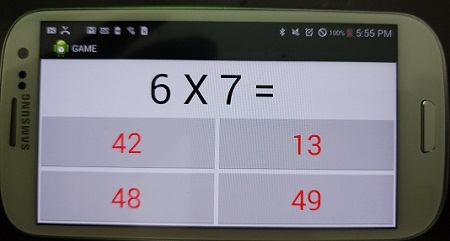

# Mathanator

Mathanador is an engaging math game designed to help users of all ages improve their arithmetic skills through a series of challenging questions and fun gameplay. Whether you're a student looking to sharpen your math abilities or an adult seeking a brain workout, Mathanador offers an entertaining way to enhance your numerical prowess.

## Features

- **User Registration:** Create your unique profile to track your progress.
- **Dynamic Difficulty Levels:** As you improve, the questions get harder.
- **Score Tracking:** Keep an eye on your high scores and personal improvement.
- **Interactive UI:** A user-friendly interface that makes learning fun and easy.

## Getting Started

To get started with Mathanador, follow these simple steps:

1. **Create Your Profile:** When you first open the app, you'll be prompted to create a new user profile.
2. **Start Playing:** Choose your difficulty level and start solving math problems to earn points!

## Screenshots
### Main Gameplay Screen

### Video

## Contributing

We welcome contributions to Mathanador! If you have suggestions for improvements or new features, please feel free to fork the repository and submit a pull request.

## License

Mathanator is released under the MIT License. See the LICENSE file for more details.

## Contact

For support or to provide feedback, please contact us at mike.h.orlando@gmail.com.

Enjoy enhancing your math skills with Mathanador!
